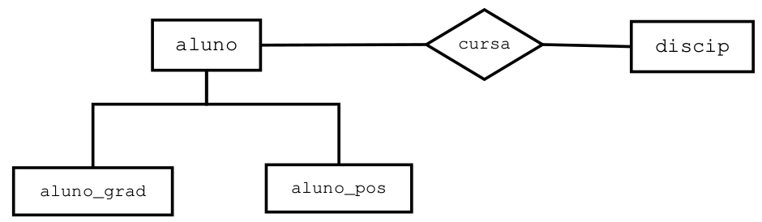

# REGRAS DE NEGÓCIO E PROGRAMAÇÃO DE SGBD

## Introdução

Nesse capítulo, iremos trabalhar com recursos utilizados tanto pelos administradores quanto pelos programadores.  
Ao longo desse material, serão abordados os seguintes assuntos:  

* Implementação de Regras de Negócio no momento de criação das tabelas (*Check*);  
* Sequências (Sequences);  
* Visões (View);  
* Procedimentos Armazenados (Stored Procedures);  
* Gatilhos (Triggers).


Antes de começarmos,**vamos criar um novo database** para os testes desse capítulo:
```sql
CREATE DATABASE chapregras;
```

## Implementando Regras de Negócio
As regras de negócio (regras aos quais os valores dos dados devem obedecer) podem serem implementadas no momento da criação das tabelas por meio das restrições *check* e *unique*.  

### Restrição Check  
A restrição CHECK no SQL é usada para impor uma condição específica em uma coluna de uma tabela. Ela garante que os valores inseridos ou atualizados naquela coluna atendam a determinados critérios, ajudando a manter a integridade dos dados.
A restrição CHECK é útil para evitar dados inválidos no banco de dados, reduzindo a necessidade de verificações adicionais na aplicação. 

**Exemplo**: Condição check que garante idades positivas:    
```sql
CREATE TABLE Clientes (
    ID INT,
    Nome VARCHAR(100),
    Idade INT,
    CONSTRAINT pk_clientes PRIMARY KEY (ID),
    CONSTRAINT ck_Idade CHECK (Idade > 0) -- Garante que apenas clientes com pelo menos 01 ano sejam cadastrados
);
```

**Exemplo**: Impedindo que um salário seja **inferior** ou **superior** a um teto:  
```sql
CREATE TABLE Funcionarios (
    ID INT PRIMARY KEY,
    Nome VARCHAR(100),
    Salario DECIMAL(10,2) CHECK (Salario BETWEEN 1000 AND 50000) -- Restringe o salário a um intervalo
);
```

### Restrição Unique
Para garantir a unicidade de valores de campos que não são chave primária, no caso **chaves candidatas**, usamos a restrição *unique*.  
A restrição UNIQUE no SQL é usada para garantir que os valores de uma ou mais colunas em uma tabela sejam únicos, ou seja, não se repitam entre as linhas. Isso **ajuda a manter a integridade dos dados**, **evitando duplicações** indesejadas.  

**Exemplo**: Na implementação da tabela Aluno, a chave primária deve ser RA e o campo CPF deve ser único:  
```sql
create table aluno(
    ra integer, -- chave candidata
    nome varchar(40),
    cpf varchar(12), -- chave candidata
    constraint pk_aluno primary key (ra),
    constraint un_cpf unique (cpf)
);
```

**Exemplo**: Podemos garantir que a combinação de duas ou mais colunas seja única:  
```sql
CREATE TABLE Pedidos (
    ID INT PRIMARY KEY,
    ClienteID INT,
    ProdutoID INT,
    UNIQUE (ClienteID, ProdutoID)  -- Garante que o mesmo cliente não peça o mesmo produto duas vezes
);
```

### 📝 Exercícios
1. Crie o modelo físico das relações **correntista** = {_cpf (pk), nome, data_nasc, cidade, uf_} e **conta_corrente** {_num_conta (pk), cpf_correntista (fk), saldo_}.
Garanta as seguintes regras de negócio:  
    (a) Os correntistas devem ser maiores que 18 anos. Para isso, você deve comparar a data de nascimento com a data atual. No Postgres, para saber a idade atual, use a função
   ```sql
   ((CURRENT_DATE - data_nasc)/365>=18) ou use a função (AGE(CURRENT_DATE, data_nasc) >= '18 Y’)).
   ```   
    (b) Uma conta corrente só pode ser aberta com saldo mínimo **inicial de R$ 500,00**.  

## _Sequences_ (Sequências)
Uma **_Sequence_** (sequência) é um objeto de banco de dados criado pelo usuário que pode ser compartilhado por vários usuários para gerar números inteiros exclusivos de acordo com regras especificadas no momento que a sequência é criada.  

A **sequence** é gerada e incrementada por uma rotina interna do SGBD. Normalmente, as sequências são usadas para criar **um valor de chave primária** que deve ser exclusivo para cada linha de uma tabela. 

Vale a pena salientar que os números de sequências **são armazenados e gerados de modo independente das tabelas**. Portanto, o mesmo objeto sequência pode ser usado por várias tabelas e inclusive por vários usuários de banco de dados caso necessário. **Mas isso não é recomendado**.

Geralmente, convém atribuir à sequência um nome de acordo com o uso a que se destina; no entanto, ela poderá ser utilizada em qualquer lugar,  independente do nome.  

Sequências são **frequentemente** utilizados para **produzir valores únicos** em colunas definidas como **chaves primárias**.  

Neste caso, você pode enxergar essas sequências como campos do tipo _auto-incremento_.  

Cada sequência deve ter um nome que a identifique. O padrão para o nome pode ser _**sid_nome_da_tabela**_.  

### Como criar uma SEQUENCE?
Para criar uma SEQUENCE, usamos o comando CREATE SEQUENCE:  
```sql
CREATE SEQUENCE sid_minha_sequence
START WITH 1  -- Primeiro valor gerado (opcional)
INCREMENT BY 1  -- Incremento entre os valores (opcional)
MINVALUE 1  -- Valor mínimo permitido (opcional)
MAXVALUE 1000  -- Valor máximo permitido (opcional)
CYCLE;  -- Faz a sequência reiniciar após atingir o MAXVALUE (opcional)
```

**Onde**:  
**START WITH 1** → Começa a sequência a partir de 1.  
**INCREMENT BY 1** → Incrementa o valor em 1 a cada chamada.  
**MINVALUE 1** → O menor valor permitido é 1.  
**MAXVALUE 1000** → O maior valor permitido é 1000 (opcional).  
**CYCLE** → Quando atinge o MAXVALUE, ele reinicia para o MINVALUE.    

### Usando as SEQUENCES (NEXTVAL)

**Exemplo**: **Criando e usando** uma sequencia para tabela Usuários:
```sql

create sequence sid_usuarios;

SELECT NEXTVAL('sid_usuarios');

CREATE TABLE Usuarios (
    ID INT PRIMARY KEY,
    Nome VARCHAR(100)
);

insert into usuarios
values (nextval('sid_usuarios'), 'joao');
```

### Usando o SERIAL ou BIGSERIAL  
O tipo de dado SERIAL no PostgreSQL é usado para criar chaves primárias **auto-incrementáveis de forma automática**. Ele internamente cria uma SEQUENCE, que gera os valores sequenciais para a coluna.  


**Exemplo**: **Criando e usando** uma sequencia para tabela Usuários:
```sql

CREATE TABLE diarios (
    diarioID SERIAL/BIGSERIAL PRIMARY KEY -- serial ou bigserial vai depender da quantidade de registros,
    descricao VARCHAR(100)
);

INSERT INTO diarios
values (default, 'Banco de Dados');
```

#### Como funciona o SERIAL internamente?
Quando usamos SERIAL, o PostgreSQL automaticamente faz três coisas:  

1. Cria uma SEQUENCE associada
2. Define a coluna como _DEFAULT nextval('sequence_name')_
3. Vincula a sequence à tabela

**Exemplo**: Exemplo do que o **PostgreSQL cria internamente** ao usar SERIAL:
```sql
CREATE SEQUENCE usuarios_id_seq START WITH 1 INCREMENT BY 1;
ALTER TABLE Usuarios ALTER COLUMN ID SET DEFAULT nextval('usuarios_id_seq');
```

### Obtendo o Último ID Inserido
Após inserir um registro, podemos recuperar o ID gerado:
```sql
INSERT INTO diarios
values (default, 'Estrutura de Dados'); RETURNING ID;

```

### CURRVAL
Traz o valor atual da sequence:
```sql
select currval('sid_usuario');
```

### Como apagar uma SEQUENCE?
Para remover uma SEQUENCE no PostgreSQL, usamos o comando:
```sql
DROP SEQUENCE minha_sequence;
```

**Exemplo**: Para apagar a sequence *sid_usuarios*:
```sql
DROP SEQUENCE sid_usuarios;
```

#### Apagando uma SEQUENCE associada a uma tabela
Se a sequência estiver vinculada a uma coluna (exemplo: ID com SERIAL), devemos remover a ligação primeiro:
```sql
ALTER TABLE diarios ALTER COLUMN diarioID DROP DEFAULT;
```

### 📝 Exercício de Sequências


1) Considere o seguinte modelo relacional baseado no DER da **figura acima**:
```sql
obra = {id_obra(pk), codigo (unique), descricao}

maquina = {id_maquina(pk), codigo(unique), marca}

usa = {id_usa(pk), id_obra(fk), id_maquina(fk), data_do_uso}
```

    1.1. Crie sequências obra, maquina e usa.
    1.2. Insira duas obras e duas máquinas usando as sequência criadas.
    1.3. Atribua para cada obra as duas máquinas.

## _OPERAÇÕES COM CONJUNTOS EM SQL_

A **Álgebra Relacional** é uma linguagem de consulta procedural (o usuário descreve os passos a serem executados) e formal a qual a técnica utilizada é fundamental para a extração de dados de um banco de dados, além de ser um conjunto de operações, os quais utilizam como recurso de entrada uma ou mais relações, produzindo então, uma nova relação.

As principais operações da Álgebra Relacional são **Seleção, Projeção, União, Diferença, Intesecção, Produto Cartesiano, Junção e Divisão**.  As **operações da linguagem SQL são baseadas nas operação da Álgebra Relacional**. Foi visto na disciplina de Banco de Dados que as operações Projeção (comando Select) , Seleção (cláusula Where), Junção (operação Inner Join) e Produto Cartesiano (cláusula FROM sem a cláusula Where).

Vamos usar um novo banco de dados. Agora, iremos rodar o script disponibilizado no repositório da disciplina:
```sql
nome do script: 00_criabaseBD_Postgres.sql
```

### Operação União (Union e Unial All)

A união de duas tabelas é formada pela adição dos registros de uma tabela aos registros de uma segunda tabela,
para produzir uma terceira. Assim, o operador **union** serve para juntar ou unir dois comandos *selects*, um
abaixo do outro. As linhas repetidas são ignoradas.

**Exemplo 1:** Monte um relatório com os nomes dos instrutores e alunos cadastrados no banco de dados. Garanta
que os **nomes repetidos sejam eliminados**:

```sql
SELECT inst_nome as Nome FROM instrutor
UNION
SELECT alu_nome as Nome FROM aluno;
```

**Exemplo 2:** Monte um relatório com os nomes dos clientes e vendedores cadastrados no banco de dados. Garanta
que os **nomes repetidos sejam eliminados**:

```sql
SELECT nome_cliente as Nome FROM cliente
UNION
SELECT nome_vendedor as Nome FROM vendedor;
```

**Exemplo 3:** Refaça a consulta anterior mostrando também os nomes repetidos:
```sql
SELECT nome_cliente as Nome FROM cliente
UNION ALL
SELECT nome_vendedor as Nome FROM vendedor;
```

**Exemplo 4:** Monte uma consulta utilizando o UNIOUN para trazer a descrição dos protudos e suas unidades. porém, traga apenas as unidades M e SAC
```sql
select descricao, unidade from produto
where unidade = 'M'
UNION
select descricao, unidade from produto
where unidade = 'SAC';
```

### Operação Interseção (comando Intersect)
Esta operação atua sobre duas tabelas compatíveis em domínio e produz uma terceira contendo os **registros que aparecem simultaneamente** em ambas tabelas. O **operador _In_** redunda no mesmo resultado do operador *Intersect*. Entretanto, aquele não necessita da compatibilidade de domínio.

**Exemplo 1:** Desenvolva uma consulta que preencha uma página html com os nomes homônimos de instrutores
e alunos:
```sql
select inst_nome as nome from instrutor
INTERSECT
select alu_nome as nome from aluno;
```

**Exemplo 2:** A Grid de um Form de uma aplicação bancária desktop deve ser preenchida com os dados de uma consulta que traga os códigos do cliente que possuem conta (tabela Depositante) e também empréstimo (tabela Devedor). Use o operador Intersect:
```sql
select cod_cli_dep from depositante
INTERSECT
select cod_cli_dev from devedor;
```

### Operação Diferença (comando Except)
A diferença de duas tabelas é uma terceira tabela contendo os registros que ocorrem na primeira tabela mas não ocorrem na segunda. O **operador _Not In_** redunda no mesmo resultado do operador **Except**. Entretanto, aquele não necessita da compatibilidade de domínio.

**Exemplo 1:** Monte um relatório que traga o código do cliente que possui conta (depositante) mas que não possui empréstimo (devedor):
```sql
select cod_cli_dep from depositante
EXCEPT
select cod_cli_dev from devedor;
```

**Exemplo 2:** Monte a consulta em SQL para um relatório que traga os nomes dos instrutores que não são homônimos dos alunos (usando o **Except**).:
```sql
select inst_nome as nome from instrutor
EXCEPT
select alu_nome as nome from aluno;
```

### Compatibilidade de domínio
Assim com as operações da Álgebra Relacional, as **operações sobre conjuntos** com os comandos SQL **exigem Compatibilidade de Domínio**, ou seja, campo texto embaixo de campo texto, campo numérico embaixo de campo numérico.


**Exemplo 1:** Execute a consulta a seguir e discuta o porquê do resultado:

```sql
select nome_cliente as nome from cliente
UNION
select total_pedido as nome from pedido;
```

### 📝 Exercícios sobre Álgebra Relacional
1) Monte uma consulta SQL para trazer os nomes dos clientes (tabela cliente) e dos vendedores (vendedor) e a respectiva quantidade de pedido (tabela pedido) que cada um realizou. Utilize o operador UNION para unir as duas consultas. Você tera que usar uma junção com pedido.


## VIEW (VISÃO)   
Do **ponto de vista do negócio,** visões são elementos estratégicos que normalmente limitam o poder de acesso a informações. Do **lado técnico**, uma **visão é uma <ins>tabela virtual</ins> resultante de uma consulta efetuada sobre uma ou mais tabelas**. A visão é baseada em uma ou mais tabelas ou outra view, logo uma view não contém dados próprios mas sim dados provenientes de outas tabelas.  
Quando se aplica o comando SELECT em uma visão, o que o SGBD faz é executar o SELECT da própria visão.

As **visões podem ser usadas** em:
• Substituir consultas longas e complexas por algo fácil de ser entendido e manipulado.
• Elementos de segurança, pois a partir do momento em que conseguem limitar o acesso dos usuários a determinados grupos de informações no BD.

### DER e Modelo Relacional para o uso de View

:exclamation: `O *script* da base de dados está dentro do arquivo **00_criabaseBD_Postgres.sql**.`

Segue o DER e o modelo relacional para uso dos exewmplos de visões:  




Modelo relacional do diagrama acima:
```sql
alunov = {id(pk), ra, nome, ender, cidade}
aluno_grad = {id(pk), ano_curso}
aluno_pos = {id(pk), orientador}
cursa = {cursa_id(pk), cursa_alu_id(fk), cursa_discip_id(fk), cursa_nota1, cursa_nota2, cursa_nota3, cursa_nota4}
discip = (disc_id(pk), disc_codigo, disc_descricao}
```

### Criando e Modificando uma Visão
Para criar ou alteramos uma visão executamos o seguinte comando:

```sql
create [or replace] view
as
subconsulta
```
**:rocket: Exemplo 1**: Desejamos criar uma visão em que aparece somente os alunos de Votuporanga:  
```sql
create view v_aluno_votuporanga
as
select *
from alunov
where cidade = 'Votuporanga';
```

**Consultando**  
```sql
select * from v_aluno_votuporanga;
```

**:rocket: Exemplo 2**: Monte um consulta SQL para o relatório que traga o nome do cliente e a quantidade de pedido que o mesmo realizou ordenado pelo o cliente que fez mais pedido para o que fez menos:  
```sql
create view v_cliente_pedido
as
select nome_cliente, count(num_pedido)
from cliente cli, pedido ped
where cli.codigo_cliente = ped.codigo_cliente
group by 1
order by 2 desc;
```

**:rocket: Exemplo 3**: Crie uma visão para um relatório que informe o **ra, nome e o ano** dos alunos de graduação:
```sql
create view v_aluno_grad
as
select ra, nome, ano_curso
from alunov alu inner join aluno_grad alugrad on (alu.id = alugrad.id);
```
**:rocket: Exemplo 4**: Crie uma visão que informe os nomes dos alunos de pós-graduação e os nomes de seus respectivos orientadores:
```sql
create view v_aluno_pos
as
select nome, orientador
from alunov Alu, aluno_pos alupos
where alu.id = alupos.id;
```

**:rocket: Exemplo 5**: Crie uma visão para um relatório que informe o nome dos alunos; se o aluno for de graduação, informe o ano; se for de pós, informe seu orientador:
```sql
create view v_rel_aluno
as
select nome, ano_curso, orientador
from alunov alu left join aluno_grad alugrad on (alu.id = alugrad.id)
                left join aluno_pos alupos on (alu.id = alupos.id) ;
```


###  Removendo uma View
Para remover uma view, utilize o comando drop view da seguinte maneira:
```sql
DROP VIEW v_aluno_votuporanga;
```

###  Regras para execução das operações DML em uma View
As visões podem ser somente de leitura ou atualizáveis.  

**Não será possível modificar os dados em uma visão** se ela contiver:  
a. Funções de grupo (_sum, count_, etc)  
b. Uma cláusula _GROUP BY_  
c. A palavra-chave _DISTINCT_  
d. Todos os **campos obrigatórios** (_not null_) da tabela base devem está presentes na visão.  

### Inserindo em uma visão
Vamos criar uma view sobre a **tabela cliente** com os campos _nome_cliente, endereco e cidade_:  
```sql
create or replace view v_dados_cliente
as
select nome_cliente, endereco, cidade
from cliente;
```
Tente fazer:  
```sql
insert into v_dados_cliente
values (’Francisco Silva’, ’Rua das Araras’, ’Votuporanga’);
```
Perceba que houve erro, pois o **código_cliente** não estava presente na view. Apague a view (DROP TABLE) e recrie-a **adicionando esse campo** e tente inserir o cliente com o código 3210.

### 📝 Exercícios sobre Visões
1. De acordo com o DER da **figura presente na seção de Exercícios de Sequências**, desenvolva as seguintes visões:  
    (a) Uma visão que mostre a descrição da obra, a máquina utilizada e a data do uso. Ordene pela descrição da obra.  
    (b) Uma visão que mostre a descrição da obra e a quantidade de máquinas utilizadas.
    (C) Uma visão que mostre o nome do cliente, prazo_entrega do pedido, a descricao do produto vendido, a quantidade e o valor_venda nos itens do pedido e o valor total por produto (item_pedido.valor_venda * item_pedido.quantidade).


## FUNÇÕES (_FUNCTIONS_) OU PROCEDIMENTOS ARMAZENADOS (_STORED PROCEDURES_)

Quando uma aplicação solicita a execução de uma query SQL comum, todo o texto da mesma é enviado pela rede do computador cliente ao servidor em que será compilado e executado. Isso gera certa demora na resposta da query.  

Para aumentar o desempenho em relação *queries*, os Sistemas Gerenciadores de Banco de Dados (SGBDs) - entre eles o Oracle, Postgres, SqlServer, etc, oferecem a capacidade de funções (*functions*) ou os procedimentos armazenados (*stored procedures*) como parte dos seus metadados.  

**Funções podem ser entendidos** como uma sequência de comandos SQLs agrupados, que são executados dentro do SGBD.  

O Postgres trabalha com Funções (*Functions*) ao invés de procedimentos. As funções são blocos PL/pgSQL nomeado que pode aceitar parâmetros (conhecidos como argumentos).  

As Funções são utilizadas para executar uma ação. Elas contêm um cabeçalho, uma seção declarativa, uma seção executável e uma seção opcional de tratamento de exceções.  

A função é chamada quando o seu nome é utilizado ou no comando SELECT ou na seção executável de outro bloco PL/pgSQL .  

As Functions são compiladas e armazenados no banco de dados como objetos de esquema. Elas promovem a capacidade de manutenção e reutilização. Quando validados, elas podem ser usadas em várias aplicações.  

**:blush: Vantagens**:
1. Podem ser criadas rotinas especializadas altamente reutilizáveis, o que torna extremamente produtivo em ambientes do tipo cliente/servidor.  
2. As rotinas rodam no servidor, liberando está carga do cliente.

**:worried: Desvantagem**:
1. Ficar restrito a sintaxe de um SGBD específico.

### Criação de uma *Function*

Pode usar a instrução SQL CREATE OR REPLACE FUNCTION para criar functions que são armazenados em um banco de dados Postgres.  
Uma FUNCTION é similar a uma miniatura de programa: ela executa uma ação específica. Especifica-se o nome da função, seus parâmetros, suas variáveis locais e o bloco BEGIN-END que contém seu código e trata qualquer exceção.  

Características do código de uma função:  
1. *Blocos PL/pgSQL*: começam com uma instrução BEGIN, podendo ser precedidos da declaração de variáveis locais, e terminam com uma instrução END ou END.  
2. *Nome do function*: A opção REPLACE indica que, se a function existir, ela será eliminado e substituído pela nova versão criada pela instrução.
3. *Parâmetro*: representa o nome de um parâmetro.
4. *Tipodedados*: especifica o tipo de dados do parâmetro, sem nenhuma precisão.

Abaixo, um modelo de código de uma Função:
```sql
CREATE [OR REPLACE] FUNCTION NomeFunção [(parâmetro1 tipo_dado1,..., parâmetroN tipo_dadoN)] RETURNS Void | tipo_dado
AS
    [ DECLARE variável tipo_dado] -- Uma função pode ou não usar variáveis
$$
BEGIN

    -- Códigos PlPgSQL  
    RETURN null | tipo_dado;

END;
$$

LANGUAGE plpgsql;
```
**:rocket: Exemplo**: Primeira função que mostra a frase `Olá mundo!`:
```sql
create or replace function f_olamundo() returns text as
$$
begin
  --Função que mostra a frase Olá Mundo!;
  return 'Olá Mundo!';
end;
$$
language PLPGSQL;

Para executar: select f_olamundo();
```

### Usando Parâmetros nas Funções
No PostgreSQL, podemos criar funções em PL/pgSQL que aceitam **parâmetros de entrada** e retornam valores específicos.

```sql
CREATE OR REPLACE FUNCTION nome_funcao(param1 tipo, param2 tipo)  
RETURNS tipo_retorno AS $$  
BEGIN  
    -- Lógica da função  
    RETURN valor;  
END;  
$$ LANGUAGE plpgsql;
```

**:rocket: Exemplo**: Retornado as posições de 2 a 5 do primeiro valores dos parâmetros de entrada, mas agora acessando o parâmetros pelo nome:
```sql
CREATE OR REPLACE FUNCTION f_substringPorNome(nomePar varchar, posicaoInicialPar integer) RETURNS varchar
AS
$$
BEGIN
    RETURN substring(nomePar,posicaoInicialPar);
END;
$$
LANGUAGEplpgsql;

uso: select f_substringPorNome('Votuporanga', 2);
```
